# 引入问题

首先，新建项目文件夹，写一个 `hello.py`：

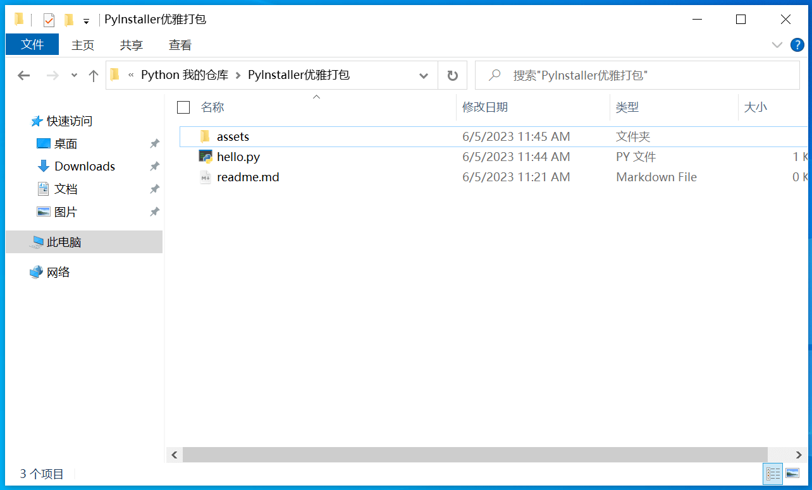 

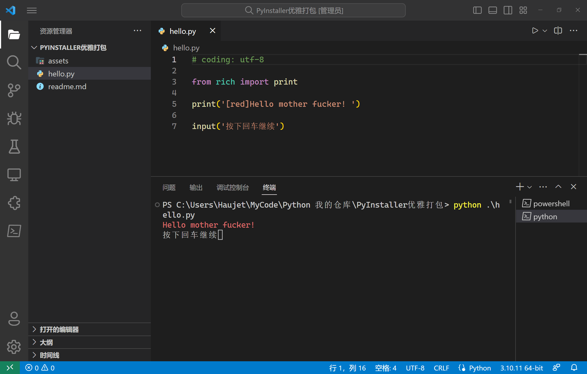 


用 PyInstaller 把 `hello.py` 打包，`pyinstaller ./hello.py`

会得到 `build` 和 `dist` 文件夹，以及 `hello.spec` 文件：

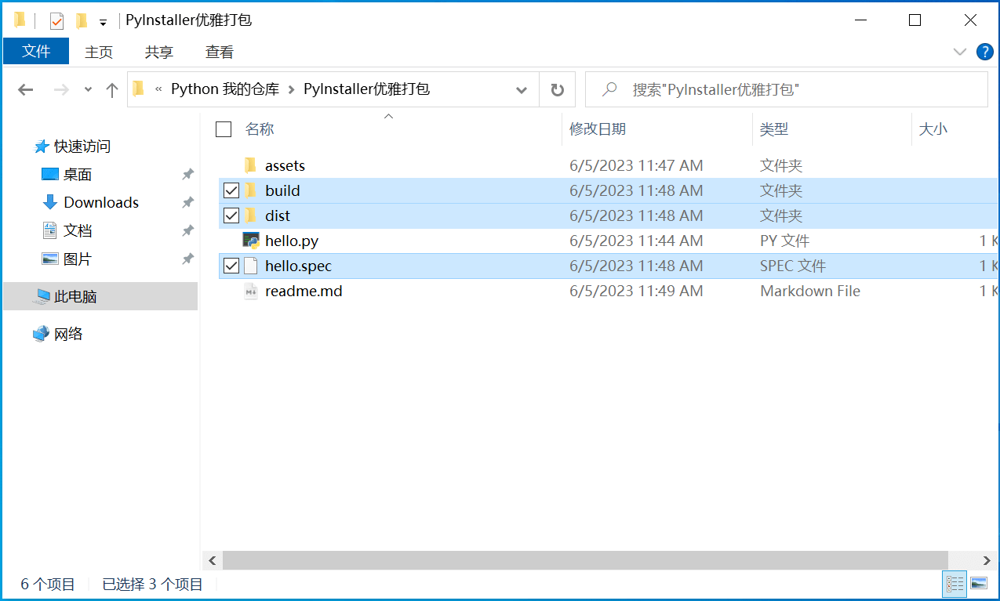 

其中：

- `build` 文件夹是存放打包时临时文件用的
- `dist` 文件夹存放了打包好的应用
- `hello.spec` 内容是 `PyInstaller` 根据我们的命令行生成的打包参数

打开 `dist/hello` 文件夹，可以看到我们打包好的 `hello.exe` 躺在一堆依赖文件之间，**非常丑陋**：

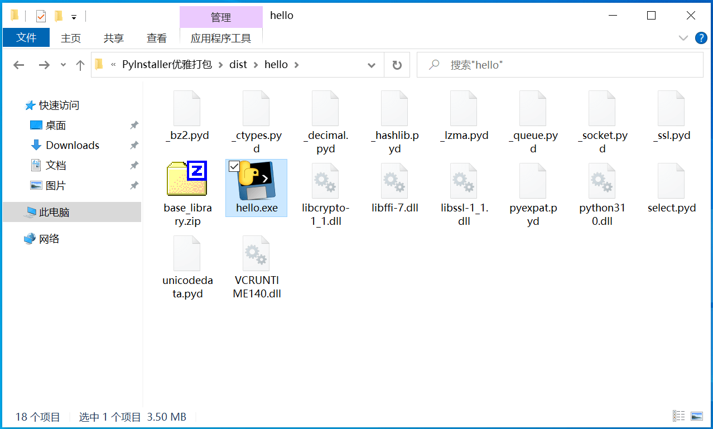 

我们的目标，就是要把这些依赖包都移到一个子文件夹中，让打包文件夹变得整洁，同时让程序正常运行。

最后我们可以打包成这个样子：

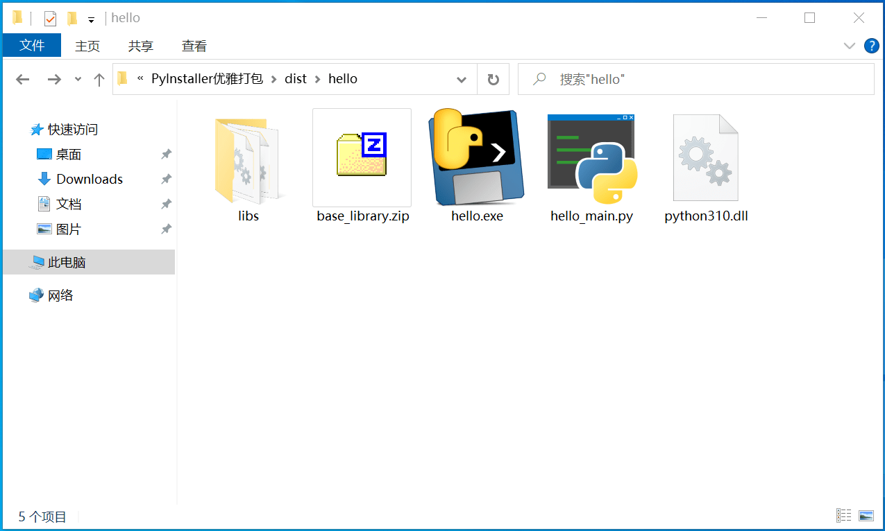 

首先，所有的依赖模块都被移动到了 libs 文件夹，整个打包根目录清清爽爽，只留下了必要的 `python310.dll` 和 `base_library.zip`。

其次，如你所见，这个程序的脾气不是太好，出口成脏，我们希望用户在拿到这个开源程序时，可以修改脚本的内容，不需要重新打包就能直接从 `hello.exe` 运行。因此我们要把 `hello.exe` 做成程序入口，实际的逻辑写在 `hello_main.py` ，同时要确保 `hello_main.py` 中的依赖都被正确打包到 `libs` 文件夹。

我们一步步解决。

# 第一步：自定义依赖包位置

## 生成 spec 文件

达到目的的关键在于用命令行打包时自动生成的 `hello.spec` ，它的本质是一个 `python` 文件，`pyinstaller` 有两种运行模式：

- `pyinstaller hello.spec` 会使用 `spec` 文件中的配置进行打包
- `pyinstaller hello.py <other args>` 根据命令行参数自动生成 `spec` 文件，再依据使用 `spec` 文件中的配置进行打包

pyinstaller 在打包时，实际上是在做了一些准备工作后，直接运行了 `spec` 文件里的 Python 代码。

相比于给命令行添加参数，直接编辑 `spec` 文件，在里面保存参数，更优雅，更方便操作。

除了直接打包脚，本文件自动生成 `spec` 配置，还可以通过执行 `pyi-makespec hello.py` 不打包，只生成 `spec` 配置。

## 解释 spec 文件

打开 `hello.spec` 文件，有如下内容（已作注释）：

```python
# -*- mode: python ; coding: utf-8 -*-


block_cipher = None

# 这一部分负责收集你的脚本需要的所有模块和文件。的；hiddenimports 参数可以指定一些 PyInstaller 无法自动检测到的模块。
a = Analysis(
    ['hello.py'],       # 指定要打包的 Python 脚本的路径（可以是相对路径）
    pathex=[],          # 用来指定模块搜索路径
    binaries=[],        # 包含了动态链接库或共享对象文件，会在运行之后自动更新，加入依赖的二进制文件
    datas=[],           # 列表，用于指定需要包含的额外文件。每个元素都是一个元组：（文件的源路径, 在打包文件中的路径)
    hiddenimports=[],   # 用于指定一些 PyInstaller 无法自动检测到的模块
    hookspath=[],       # 指定查找 PyInstaller 钩子的路径
    hooksconfig={},     # 自定义 hook 配置，这是一个字典，一行注释写不下，此处先不讲
    runtime_hooks=[],   # 指定运行时 hook，本质是一个 Python 脚本，hook 会在你的脚本运行前运行，可用于准备环境
    excludes=[],        # 用于指定需要排除的模块
    win_no_prefer_redirects=False,
    win_private_assemblies=False,
    cipher=block_cipher,
    noarchive=False,
)
# 除此之外，a 还有一些没有列出的属性：
#   pure 是一个列表，包含了所有纯 Python 模块的信息，每个元素是一个元组，包含了：模块名, pyc路径, py 路径，这些模块会被打包到一个 .pyz 文件中。
#   scripts 是一个列表，包含了你的 Python 脚本的信息。每个元素是一个元组，其中包含了脚本的内部名，脚本的源路径，以及一些元数据。这些脚本会被打包到一个可执行文件中。


# pyz 是指生成的可执行文件的名称。它是由 PyInstaller 用来打包 Python 程序和依赖项的主要文件。


# 创建 pyz 文件，它在运行时会被解压缩到临时目录中，然后被加载和执行。它会被打包进 exe 文件
pyz = PYZ(a.pure, a.zipped_data, cipher=block_cipher)


# 创建 exe 文件
exe = EXE(
    pyz,            # 包含了所有纯 Python 模块
    a.scripts,      # 包含了主脚本及其依赖
    [],             # 所有需要打包到 exe 文件内的二进制文件
    exclude_binaries=True,  # 若为 True，所有的二进制文件将被排除在 exe 之外，转而被 COLLECT 函数收集
    name='hello',   # 生成的 exe 文件的名字。
    debug=False,    # 打包过程中是否打印调试信息？
    bootloader_ignore_signals=False,
    strip=False,    # 是否移除所有的符号信息，使打包出的 exe 文件更小
    upx=True,       # 是否用 upx 压缩 exe 文件
    console=True,   # 若为 True 则在控制台窗口中运行，否则作为后台进程运行
    disable_windowed_traceback=False,
    argv_emulation=False,
    target_arch=None,
    codesign_identity=None,
    entitlements_file=None,
)


# 这个对象包含了所有需要分发的文件
# 包括 EXE 函数创建的 exe 文件、所有的二进制文件、zip 文件（如果有的话）和数据文件
coll = COLLECT(
    exe,
    a.binaries,
    a.zipfiles,
    a.datas,
    strip=False,
    upx=True,
    upx_exclude=[],
    name='hello',   # 生成的文件夹的名字
)

```

## 加入 Hook

通过对 `spec` 文件的了解，我们知道了，可以在 `a.runtimehooks` 列表中加入 `python` 脚本 `hook` ，它会在我们的主代码执行之前运行，为我们准备环境。

在这个 `hook` 里面，我们就可以修改 `sys.path` ，自定义 Python 查找模块的路径，或者环境变量

那我们就写一个 `hook.py`

```python
import sys
from pprint import pprint

print(f'\n\n模块查找路径：')
pprint(sys.path)

print('\n')
```

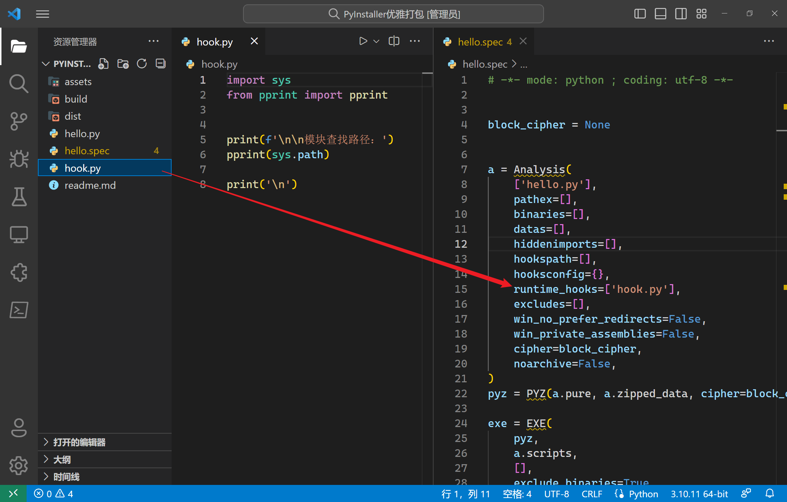


然后，用 `pyinstaller hello.spec` 进行打包，再执行得到的 `hello.exe`，得到如下输出：

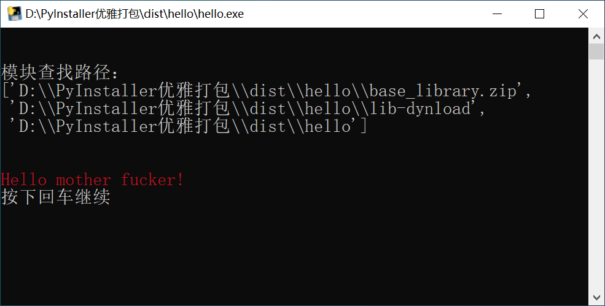 

可见 `hook.py` 确实在 `hello.py` 之前运行了，且打印出了 `sys.path` ，即模块查找路径，有三个：

- `dist/hello/base_library.zip` 这个是程序所在目录的 base_library.zip 文件
- `dist/hello/lib-dynload`  这个是运行程序时动态生成的
- `dist/hello/` 这个是程序所在目录

## hook 修改 sys.path

因此，我们就可以在打包输出文件夹中新建一个 `libs` 文件夹，将所有的依赖文件全都放进去，然后在 `hook.py` 里把 `libs` 路径加入 `sys.path` ，然后我们的脚本运行时就正确搜索到依赖包了。

改写 hook.py

```python
import sys
from pathlib import Path
from pprint import pprint

BASE_DIR = Path(__file__).parent

for p in sys.path.copy():
    relative_p = Path(p).relative_to(BASE_DIR)
    new_p = BASE_DIR / 'libs' / relative_p
    sys.path.insert(0, str(new_p))

print(f'\n\n模块查找路径：')
pprint(sys.path)

print('\n')
```

然后，用 `pyinstaller hello.spec` 进行打包，再执行得到的 `hello.exe`，得到如下输出：

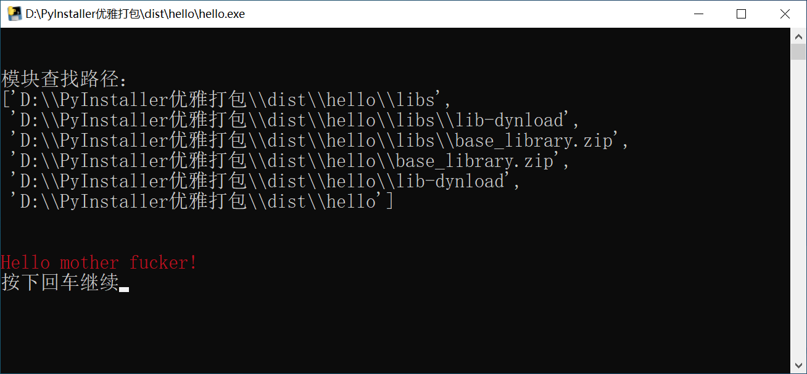 

从输出可以看到模块查找路径，已经修改成功，新增了 `libs` 文件夹。

既然模块查找路径添加成功。那我们就 **手动** 把所有的依赖文件都移动到 `libs` 子文件夹中，再运行 `hello.exe` ，完美运行：


> 需要注意的是：由于 `hook` 也是 `python` 脚本，运行 `hook` 需要 `python` 环境，所以 `python310.dll` 和 `base_library.zip` 不能移动到 `libs` 文件夹中。
>
> 我用的 `Python` 版本是3.10，所以会有一个 `python310.dll`，具体的文件名会随你安装的 `Python` 版本而变化

## 查看依赖目标位置

虽然我们在打包后将依赖文件移动到 `libs` 文件夹，程序能正常运行，但是我们肯定不希望每次打包都要 **手动** 移动一次。

实际上我们可以在 `spec` 文件中定义依赖文件和二进制文件的存放位置。

`pyinstaller` 在执行 `spec` 文件中的代码时，自动分析找到所需的依赖文件后，会把他们的目标路径和原始路径写到 `a.binaries` ，我们可以把它打印出来看一下。

修改 `hello.spec` 文件

```python
# -*- mode: python ; coding: utf-8 -*-


block_cipher = None


a = Analysis(
    ['hello.py'],
    pathex=[],
    binaries=[],
    datas=[],
    hiddenimports=[],
    hookspath=[],
    hooksconfig={},
    runtime_hooks=['hook.py'],
    excludes=[],
    win_no_prefer_redirects=False,
    win_private_assemblies=False,
    cipher=block_cipher,
    noarchive=False,
)


from pprint import pprint
pprint(a.binaries)  # 打印 a.binaries


pyz = PYZ(a.pure, a.zipped_data, cipher=block_cipher)

exe = EXE(
    pyz,
    a.scripts,
    [],
    exclude_binaries=True,
    name='hello',
    debug=False,
    bootloader_ignore_signals=False,
    strip=False,
    upx=True,
    console=True,
    disable_windowed_traceback=False,
    argv_emulation=False,
    target_arch=None,
    codesign_identity=None,
    entitlements_file=None,
)
coll = COLLECT(
    exe,
    a.binaries,
    a.zipfiles,
    a.datas,
    strip=False,
    upx=True,
    upx_exclude=[],
    name='hello',
)
```

然后，用 `pyinstaller hello.spec` 进行打包过程中得到如下输出：

```python
[('api-ms-win-crt-runtime-l1-1-0.dll',
  'C:\\Portable_library\\java\\jdk-14.0.1\\bin\\api-ms-win-crt-runtime-l1-1-0.dll',
  'BINARY'),
 ('python310.dll',
  'C:\\Users\\Haujet\\AppData\\Local\\Programs\\Python\\Python310\\python310.dll',
  'BINARY'),
 ('api-ms-win-crt-heap-l1-1-0.dll',
  'C:\\Portable_library\\java\\jdk-14.0.1\\bin\\api-ms-win-crt-heap-l1-1-0.dll',
  'BINARY'),
 ('VCRUNTIME140.dll',
  'C:\\Users\\Haujet\\AppData\\Local\\Programs\\Python\\Python310\\VCRUNTIME140.dll',
  'BINARY'),
  # 剩下的项就省略了
  ]
```

可以看到，`a.binaries` 是一个列表，其中的元素是元组，元组有3个内容：

1. 依赖文件目标路径
2. 依赖文件原始路径
3. 文件类型

我们只需要修改 `a.binaries` ，在目标路径前加上 `libs` 就可以了，同时，要确保 `python310.dll` 和 `base_library.zip` 不被修改。

## 修改依赖目标位置

编辑 `hello.spec` 文件：

```python
# -*- mode: python ; coding: utf-8 -*-


block_cipher = None


a = Analysis(
    ['hello.py'],
    pathex=[],
    binaries=[],
    datas=[],
    hiddenimports=[],
    hookspath=[],
    hooksconfig={},
    runtime_hooks=['hook.py'],
    excludes=[],
    win_no_prefer_redirects=False,
    win_private_assemblies=False,
    cipher=block_cipher,
    noarchive=False,
)


import re
import os

# 用一个函数选择性对依赖文件目标路径改名
def new_dest(package: str):
    if package == 'base_library.zip' or re.match(r'python\d+.dll', package):
        return package
    return 'libs' + os.sep + package

a.binaries = [(new_dest(x[0]), x[1], x[2]) for x in a.binaries]


# 打印 a.binaries，检查依赖文件目标路径
from pprint import pprint
pprint(a.binaries)


pyz = PYZ(a.pure, a.zipped_data, cipher=block_cipher)

exe = EXE(
    pyz,
    a.scripts,
    [],
    exclude_binaries=True,
    name='hello',
    debug=False,
    bootloader_ignore_signals=False,
    strip=False,
    upx=True,
    console=True,
    disable_windowed_traceback=False,
    argv_emulation=False,
    target_arch=None,
    codesign_identity=None,
    entitlements_file=None,
)
coll = COLLECT(
    exe,
    a.binaries,
    a.zipfiles,
    a.datas,
    strip=False,
    upx=True,
    upx_exclude=[],
    name='hello',
)
```

然后，用 `pyinstaller hello.spec` 进行打包，再执行得到的 `hello.exe`，得到如下输出：

```python
[('libs\\VCRUNTIME140.dll',
  'C:\\Users\\Haujet\\AppData\\Local\\Programs\\Python\\Python310\\VCRUNTIME140.dll',
  'BINARY'),
 ('python310.dll',
  'C:\\Users\\Haujet\\AppData\\Local\\Programs\\Python\\Python310\\python310.dll',
  'BINARY'),
 ('libs\\_decimal.pyd',
  'C:\\Users\\Haujet\\AppData\\Local\\Programs\\Python\\Python310\\DLLs\\_decimal.pyd',
  'EXTENSION'),
  # 剩下的省略了
 ]
```

得到了干净的输出目录， `hello.exe` 也能够正常运行：

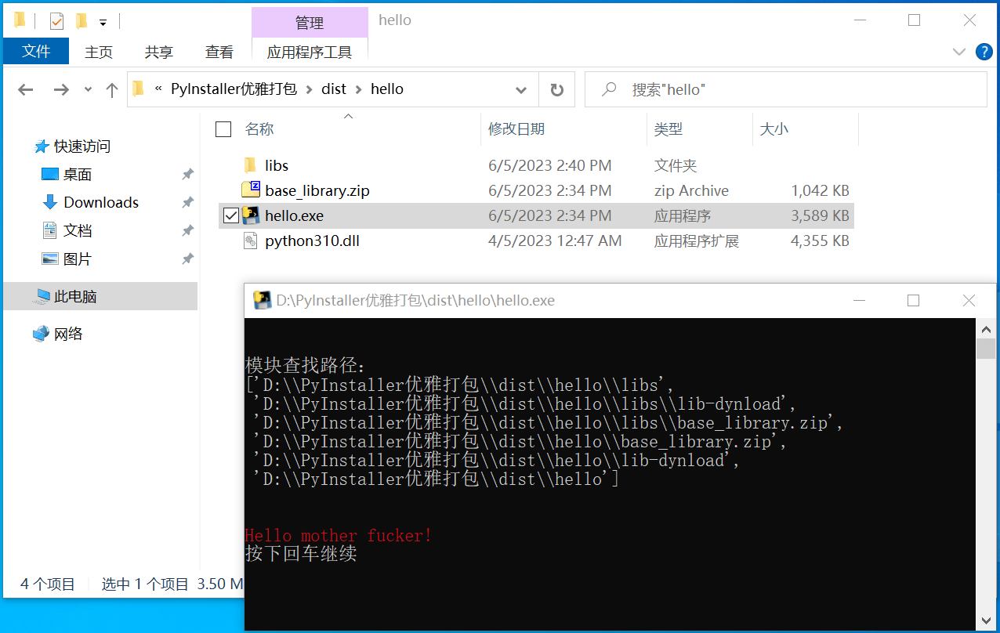

但是如你所见，这个程序脾气不好，爆粗口，用户可能会想要修改其中的代码，但又不想配置环境、重新打包。

因此接下来我们就要把 `hello.exe` 作为程序入口，实际的逻辑写在 `hello_main.py` ，同时确保 `hello_main.py` 中的依赖都被正确打包到 `libs` 文件夹。这样，用户就可以通过编辑 `hello_main.py` 来修改程序行为了。

# 第二步：打包可修改程序

## 制作入口

新建文件 `hello_main.py` ，将 `hello.py` 的代码逻辑复制进去，并且要稍作修改：

```python
# coding: utf-8

from rich import print

def main(*args, **kwargs):

    print('[red]Hello mother fucker! ')
    input('按下回车继续')

if __name__ == "__main__":
    main()
```

然后修改 `hello.py`，将其制作成程序入口，调用 `hello_main.py` 中的 `main` 函数：

```python
# coding: utf-8

import hello_main

hello_main.main()
```

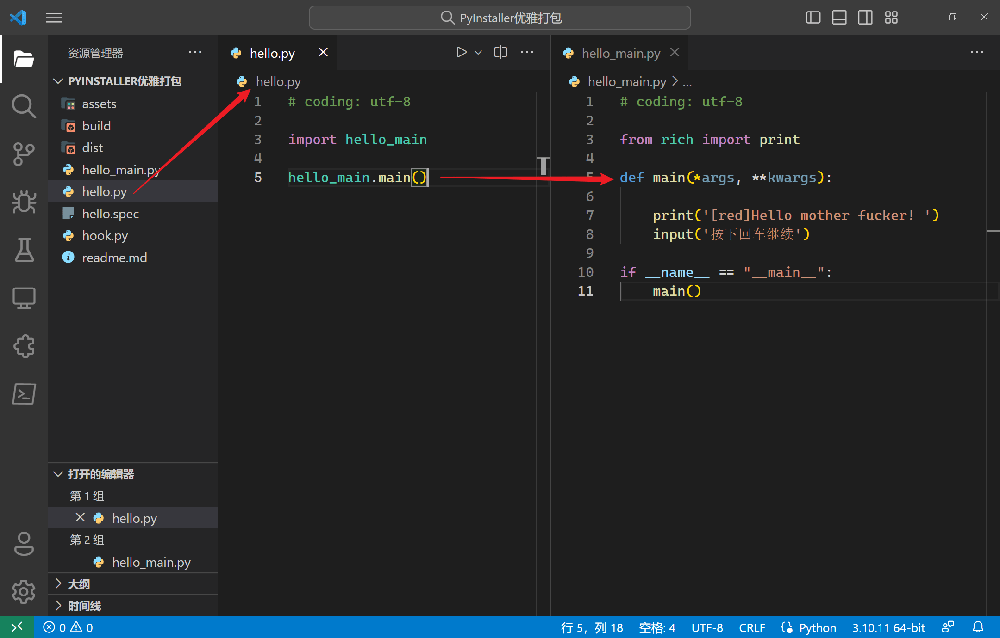 

然后，用 `pyinstaller hello.spec` 进行打包，但是我们会发现，打包出的程序与之前一模一样，虽然打包出的 `hello.exe` 能正常运行，但是我们却找不到 `hello_main.py` ：

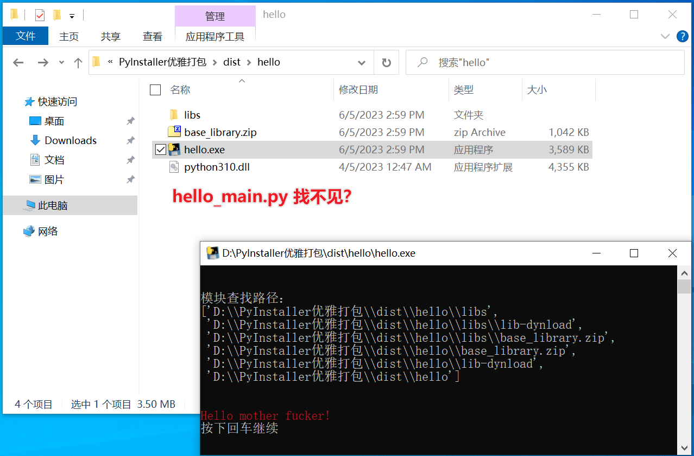 

## 查看被打包的 py 模块

找不到 `hello_main.py` 的原因是，它被打包进了 `hello.exe` 中，所有被引用到的 py 文件都会被打包进 exe 文件中。

我们回顾一下开头 `spec` 文件中内容的注释：

```python
# 除此之外，a 还有一些没有列出的属性：
#   pure 是一个列表，包含了所有纯 Python 模块的信息，这些模块会被打包到一个 .pyz 文件中。
#   scripts 是一个列表，包含了你的 Python 脚本的信息。这些脚本会被打包到一个 exe 文件中。
```

`hello.py` 是主脚本，会被加到 `a.scripts` 列表中，进而打包到 `exe` 中，`hello_main.py` 则是作为被导入的 `py` 模块，被加到了 `a.pure` 列表，后序被打包到 `pyz` 中。我们可以编辑 `hello.spec`，在打包过程中显示出有哪些 `py` 文件被打包了：

```python
a = Analysis(
    ['hello.py'],
    pathex=[],
    binaries=[],
    datas=[],
    hiddenimports=[],
    hookspath=[],
    hooksconfig={},
    runtime_hooks=['hook.py'],
    excludes=[],
    win_no_prefer_redirects=False,
    win_private_assemblies=False,
    cipher=block_cipher,
    noarchive=False,
)

import re
import os

# 用一个函数选择性对依赖文件目标路径改名
def new_dest(package: str):
    if package == 'base_library.zip' or re.match(r'python\d+.dll', package):
        return package
    return 'libs' + os.sep + package

a.binaries = [(new_dest(x[0]), x[1], x[2]) for x in a.binaries]


# 打印 a.pure，显示哪些 py 文件被打包
from pprint import pprint
pprint(a.pure)

pyz = PYZ(a.pure, a.zipped_data, cipher=block_cipher)

... # 后面的代码省略了
```

然后，用 `pyinstaller hello.spec` 进行打包，在输出中可以搜索到：

```python
[
...
 ('http.cookiejar',  '...\\Python310\\lib\\http\\cookiejar.py',  'PYMODULE'),
 ('hello_main',      'D:\\PyInstaller优雅打包\\hello_main.py', 'PYMODULE'),
 ('rich',            '...Python310\\lib\\site-packages\\rich\\__init__.py','PYMODULE'),
 ...
 ]
```

`hello_main` 赫然在列。

## 阻止 py 模块被打包

既然 `hello_main.py` 是因为被自动加入到 `a.pure` 列表导致被打包的，那我们就可以在 `spec` 文件中将它从 `a.pure` 中剔除。

此外，我们还需要将 `hello_main.py` 添加到 `a.datas` 列表中，将它作为普通文件被复制到打包文件夹，编辑 `hello.spec` ：

```python
# -*- mode: python ; coding: utf-8 -*-


block_cipher = None


a = Analysis(
    ['hello.py'],
    pathex=[],
    binaries=[],
    datas=[],
    hiddenimports=[],
    hookspath=[],
    hooksconfig={},
    runtime_hooks=['hook.py'],
    excludes=[],
    win_no_prefer_redirects=False,
    win_private_assemblies=False,
    cipher=block_cipher,
    noarchive=False,
)

import re
import os

# 用一个函数选择性对依赖文件目标路径改名，重定向到 libs 文件夹
def new_dest(package: str):
    if package == 'base_library.zip' or re.match(r'python\d+.dll', package):
        return package
    return 'libs' + os.sep + package

a.binaries = [(new_dest(x[0]), x[1], x[2]) for x in a.binaries]

# 将需要排除的模块写到一个列表（不带 .py）
my_modules = ['hello_main', ]

# 将被排除的模块添加到 a.datas
for name in my_modules:
    source_file = name + '.py'
    dest_file = name + '.py'
    a.datas.append((source_file, dest_file, 'DATA'))

# 筛选 a.pure
a.pure = [x for x in a.pure if x[0] not in my_modules]

# 打印 a.dates ，显示哪些文件被复制到打包文件夹
from pprint import pprint
pprint(a.datas)

pyz = PYZ(a.pure, a.zipped_data, cipher=block_cipher)

exe = EXE(
    pyz,
    a.scripts,
    [],
    exclude_binaries=True,
    name='hello',
    debug=False,
    bootloader_ignore_signals=False,
    strip=False,
    upx=True,
    console=True,
    disable_windowed_traceback=False,
    argv_emulation=False,
    target_arch=None,
    codesign_identity=None,
    entitlements_file=None,
)
coll = COLLECT(
    exe,
    a.binaries,
    a.zipfiles,
    a.datas,
    strip=False,
    upx=True,
    upx_exclude=[],
    name='hello',
)
```

> 此时，`hook.py` 中的 `print` 语句可以删掉了。

然后，用 `pyinstaller hello.spec` 进行打包，输出中得到：

```python
[
 ('base_library.zip', 'D:\\PyInstaller优雅打包\\build\\hello\\base_library.zip', 'DATA'),
 ('hello_main.py', 'hello_main.py', 'DATA')
]
```

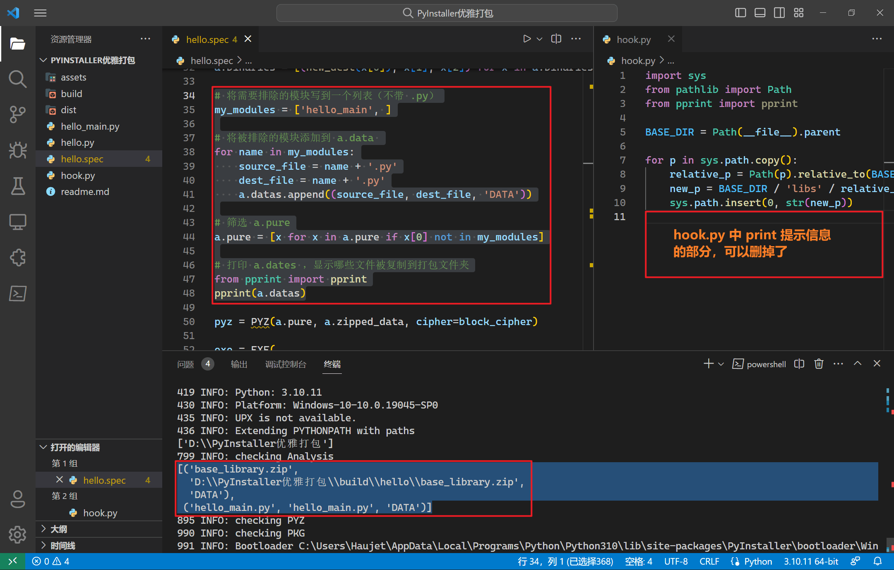

同时也可以在打包输出文件夹中看到 `hello_main.py` 了，并且程序能正常执行：

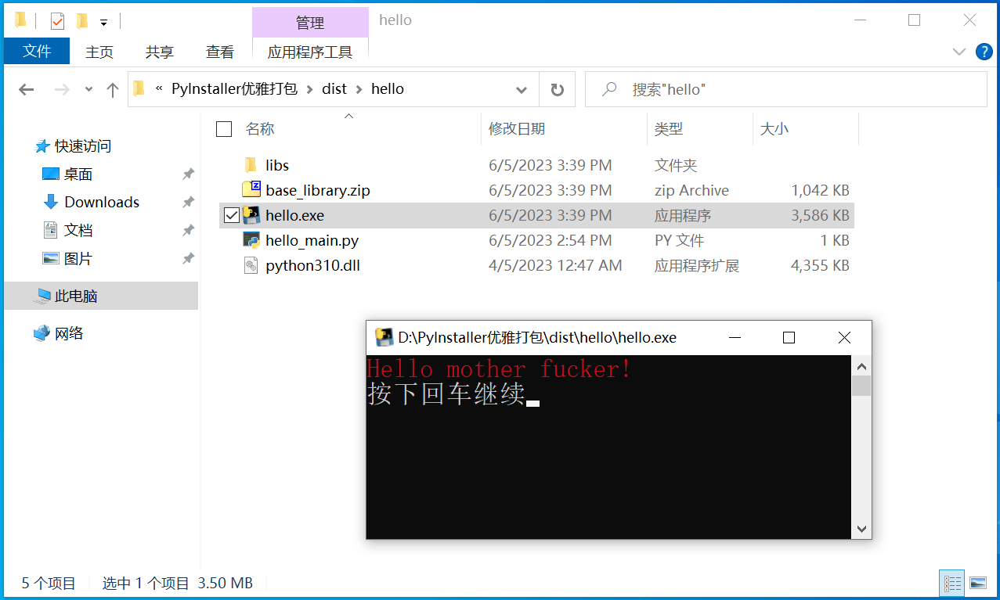 

## 编辑 py 后再运行

现在，用户就可以编辑 `hello_main.py` 后直接从 `hello.exe` 运行了，不需要重新打包（需要引入新库的情况除外）。

用户终于可以动手把这个脾气暴躁的程序教育成一个健康积极的程序了：

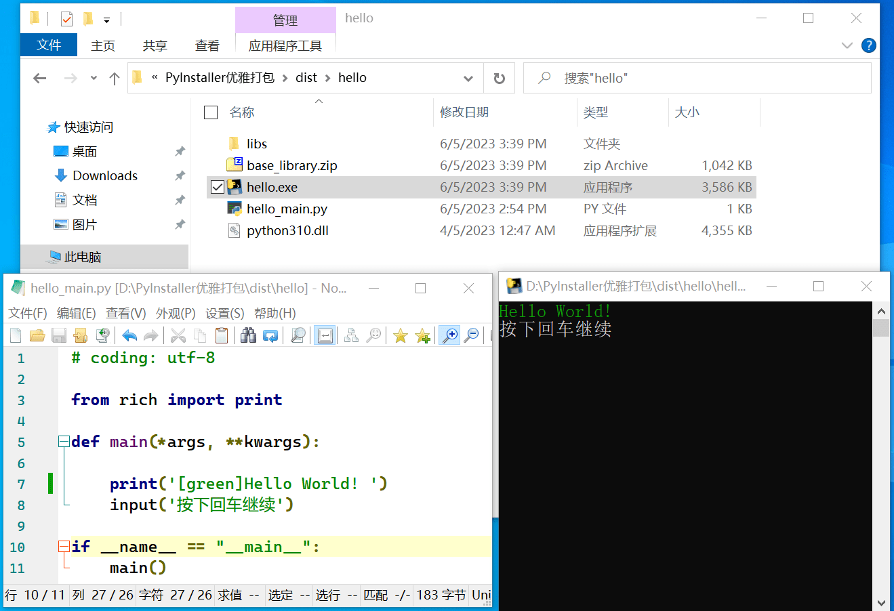 

# 后记

此外，还可以进一步修改 `hello.spec` ，进而得到更完善的程序，例如导入额外的包、添加图标、添加其他资源。

这就是一个打包程序的模板了。

多亏有 ChatGPT 这一个知识渊博、毫无厌倦的老师，耐心的回答我提出的每一个细节问题，才能有这么一个完美的打包方案。
