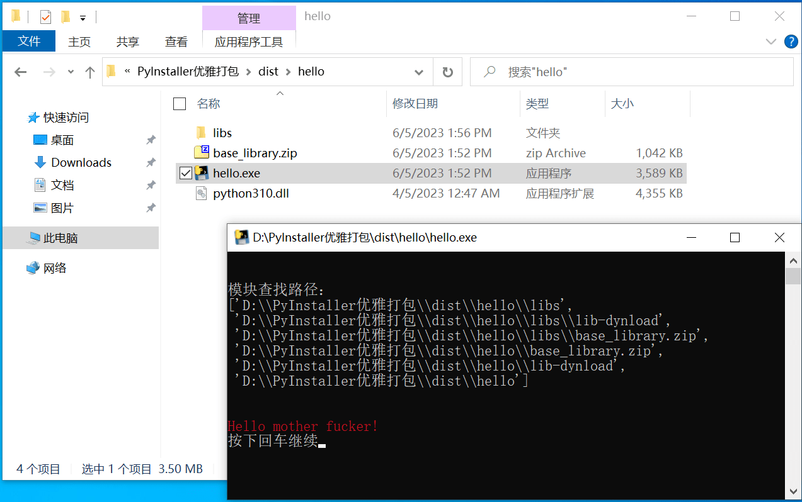

# 引入问题

如果我要写一个 Python 项目，打包成 exe 运行（方便在没有 Python 的电脑上使用），我需要打包出的根目录结构美观，没有多余的、杂乱的依赖文件在那里碍眼，而且需要在发现 bug 时，我还需要能够修改里面的代码后，无需再次打包，就能正常运行，该怎么做呢？

就以一个 Hello 项目为例，记一下我找到的完美方法。

首先，新建项目文件夹，写一个 `hello.py`：

 

 


用 PyInstaller 把 `hello.py` 打包，`pyinstaller ./hello.py`

会得到 `build` 和 `dist` 文件夹，以及 `hello.spec` 文件：

 

> 为了方便文件名排序，在下面我把 `hello.spec` 重命名成了 `build-hello.py` 

其中：

- `build` 文件夹是存放打包时临时文件用的
- `dist` 文件夹存放了打包好的应用
- `build-hello.spec` 内容是 `PyInstaller` 根据我们的命令行生成的打包参数

打开 `dist/hello` 文件夹，可以看到我们打包好的 `hello.exe` 躺在一堆依赖文件之间，**非常丑陋**：

 

我们的目标，就是要把这些依赖包都移到一个子文件夹中，让打包文件夹变得整洁，同时让程序正常运行。

最后我们可以打包成这个样子：

 

首先，所有的依赖模块都被移动到了 libs 文件夹，整个打包根目录清清爽爽，只留下了必要的 `python310.dll` 和 `base_library.zip`。

其次，如你所见，这个程序的脾气不是太好，出口成脏，我们希望用户在拿到这个开源程序时，可以修改脚本的内容，不需要重新打包就能直接从 `hello.exe` 运行。因此我们要把 `hello.exe` 做成程序入口，实际的逻辑写在 `hello_main.py` ，同时要确保 `hello_main.py` 中的依赖都被正确打包到 `libs` 文件夹。

我们一步步解决。

# 第一步：自定义依赖包位置

## 生成 spec 文件

达到目的的关键在于用命令行打包时自动生成的 `hello.spec` （为方便文件名排序，已重命名为 `build-hello.spec`），它的本质是一个 `python` 文件，`pyinstaller` 有两种运行模式：

- `pyinstaller build-hello.spec` 会使用 `spec` 文件中的配置进行打包
- `pyinstaller hello.py <other args>` 根据命令行参数自动生成 `spec` 文件，再依据使用 `spec` 文件中的配置进行打包

pyinstaller 在打包时，实际上是在做了一些准备工作后，直接运行了 `spec` 文件里的 Python 代码。

相比于给命令行添加参数，直接编辑 `spec` 文件，在里面保存参数，更优雅，更方便操作。

除了直接打包脚，本文件自动生成 `spec` 配置，还可以通过执行 `pyi-makespec hello.py` 不打包，只生成 `spec` 配置。

## 解释 spec 文件

打开 `build-hello.spec` 文件，有如下内容（已作注释）：

```python
# -*- mode: python ; coding: utf-8 -*-


block_cipher = None

# 这一部分负责收集你的脚本需要的所有模块和文件。的；hiddenimports 参数可以指定一些 PyInstaller 无法自动检测到的模块。
a = Analysis(
    ['hello.py'],       # 指定要打包的 Python 脚本的路径（可以是相对路径）
    pathex=[],          # 用来指定模块搜索路径
    binaries=[],        # 包含了动态链接库或共享对象文件，会在运行之后自动更新，加入依赖的二进制文件
    datas=[],           # 列表，用于指定需要包含的额外文件。每个元素都是一个元组：（文件的源路径, 在打包文件中的路径)
    hiddenimports=[],   # 用于指定一些 PyInstaller 无法自动检测到的模块
    hookspath=[],       # 指定查找 PyInstaller 钩子的路径
    hooksconfig={},     # 自定义 hook 配置，这是一个字典，一行注释写不下，此处先不讲
    runtime_hooks=[],   # 指定运行时 hook，本质是一个 Python 脚本，hook 会在你的脚本运行前运行，可用于准备环境
    excludes=[],        # 用于指定需要排除的模块
    win_no_prefer_redirects=False,
    win_private_assemblies=False,
    cipher=block_cipher,
    noarchive=False,
)
# 除此之外，a 还有一些没有列出的属性：
#   pure 是一个列表，包含了所有纯 Python 模块的信息，每个元素是一个元组，包含了：模块名, pyc路径, py 路径，这些模块会被打包到一个 .pyz 文件中。
#   scripts 是一个列表，包含了你的 Python 脚本的信息。每个元素是一个元组，其中包含了脚本的内部名，脚本的源路径，以及一些元数据。这些脚本会被打包到一个可执行文件中。


# pyz 是指生成的可执行文件的名称。它是由 PyInstaller 用来打包 Python 程序和依赖项的主要文件。


# 创建 pyz 文件，它在运行时会被解压缩到临时目录中，然后被加载和执行。它会被打包进 exe 文件
pyz = PYZ(a.pure, a.zipped_data, cipher=block_cipher)


# 创建 exe 文件
exe = EXE(
    pyz,            # 包含了所有纯 Python 模块
    a.scripts,      # 包含了主脚本及其依赖
    [],             # 所有需要打包到 exe 文件内的二进制文件
    exclude_binaries=True,  # 若为 True，所有的二进制文件将被排除在 exe 之外，转而被 COLLECT 函数收集
    name='hello',   # 生成的 exe 文件的名字。
    debug=False,    # 打包过程中是否打印调试信息？
    bootloader_ignore_signals=False,
    strip=False,    # 是否移除所有的符号信息，使打包出的 exe 文件更小
    upx=True,       # 是否用 upx 压缩 exe 文件
    console=True,   # 若为 True 则在控制台窗口中运行，否则作为后台进程运行
    disable_windowed_traceback=False,
    argv_emulation=False,
    target_arch=None,
    codesign_identity=None,
    entitlements_file=None,
)


# 这个对象包含了所有需要分发的文件
# 包括 EXE 函数创建的 exe 文件、所有的二进制文件、zip 文件（如果有的话）和数据文件
coll = COLLECT(
    exe,
    a.binaries,
    a.zipfiles,
    a.datas,
    strip=False,
    upx=True,
    upx_exclude=[],
    name='hello',   # 生成的文件夹的名字
)

```

## 加入 Hook

通过对 `spec` 文件的了解，我们知道了，可以在 `a.runtimehooks` 列表中加入 `python` 脚本 `hook` ，它会在我们的主代码执行之前运行，为我们准备环境。

在这个 `hook` 里面，我们就可以修改 `sys.path` ，自定义 Python 查找模块的路径，或者环境变量

那我们就写一个 `hook.py`

```python
import sys
from pprint import pprint

print(f'\n\n模块查找路径：')
pprint(sys.path)

print('\n')
```


然后，用 `pyinstaller build-hello.spec` 进行打包，再执行得到的 `hello.exe`，得到如下输出：

 

可见 `hook.py` 确实在 `hello.py` 之前运行了，且打印出了 `sys.path` ，即模块查找路径，有三个：

- `dist/hello/base_library.zip` 这个是程序所在目录的 base_library.zip 文件
- `dist/hello/lib-dynload`  这个是运行程序时动态生成的
- `dist/hello/` 这个是程序所在目录

## hook 修改 sys.path

因此，我们就可以在打包输出文件夹中新建一个 `libs` 文件夹，将所有的依赖文件全都放进去，然后在 `hook.py` 里把 `libs` 路径加入 `sys.path` ，然后我们的脚本运行时就正确搜索到依赖包了。

改写 hook.py

```python
import sys
from pathlib import Path
from pprint import pprint

BASE_DIR = Path(__file__).parent

for p in sys.path.copy():
    relative_p = Path(p).relative_to(BASE_DIR)
    new_p = BASE_DIR / 'libs' / relative_p
    sys.path.insert(0, str(new_p))

print(f'\n\n模块查找路径：')
pprint(sys.path)

print('\n')
```

然后，用 `pyinstaller build-hello.spec` 进行打包，再执行得到的 `hello.exe`，得到如下输出：

 

从输出可以看到模块查找路径，已经修改成功，新增了 `libs` 文件夹。

既然模块查找路径添加成功。那我们就 **手动** 把所有的依赖文件都移动到 `libs` 子文件夹中，再运行 `hello.exe` ，完美运行：



> 需要注意的是：由于 `hook` 也是 `python` 脚本，运行 `hook` 需要 `python` 环境，所以 `python310.dll` 和 `base_library.zip` 不能移动到 `libs` 文件夹中。
>
> 我用的 `Python` 版本是3.10，所以会有一个 `python310.dll`，具体的文件名会随你安装的 `Python` 版本而变化

## 查看依赖目标位置

虽然我们在打包后将依赖文件移动到 `libs` 文件夹，程序能正常运行，但是我们肯定不希望每次打包都要 **手动** 移动一次。

实际上我们可以在 `spec` 文件中定义依赖文件和二进制文件的存放位置。

`pyinstaller` 在执行 `spec` 文件中的代码时，自动分析找到所需的依赖文件后，会把他们的目标路径和原始路径写到 `a.binaries` ，我们可以把它打印出来看一下。

修改 `build-hello.spec` 文件

```python
# -*- mode: python ; coding: utf-8 -*-


block_cipher = None


a = Analysis(
    ['hello.py'],
    pathex=[],
    binaries=[],
    datas=[],
    hiddenimports=[],
    hookspath=[],
    hooksconfig={},
    runtime_hooks=['hook.py'],
    excludes=[],
    win_no_prefer_redirects=False,
    win_private_assemblies=False,
    cipher=block_cipher,
    noarchive=False,
)


from pprint import pprint
pprint(a.binaries)  # 打印 a.binaries


pyz = PYZ(a.pure, a.zipped_data, cipher=block_cipher)

exe = EXE(
    pyz,
    a.scripts,
    [],
    exclude_binaries=True,
    name='hello',
    debug=False,
    bootloader_ignore_signals=False,
    strip=False,
    upx=True,
    console=True,
    disable_windowed_traceback=False,
    argv_emulation=False,
    target_arch=None,
    codesign_identity=None,
    entitlements_file=None,
)
coll = COLLECT(
    exe,
    a.binaries,
    a.zipfiles,
    a.datas,
    strip=False,
    upx=True,
    upx_exclude=[],
    name='hello',
)
```

然后，用 `pyinstaller build-hello.spec` 进行打包过程中得到如下输出：

```python
[('api-ms-win-crt-runtime-l1-1-0.dll',
  'C:\\Portable_library\\java\\jdk-14.0.1\\bin\\api-ms-win-crt-runtime-l1-1-0.dll',
  'BINARY'),
 ('python310.dll',
  'C:\\Users\\Haujet\\AppData\\Local\\Programs\\Python\\Python310\\python310.dll',
  'BINARY'),
 ('api-ms-win-crt-heap-l1-1-0.dll',
  'C:\\Portable_library\\java\\jdk-14.0.1\\bin\\api-ms-win-crt-heap-l1-1-0.dll',
  'BINARY'),
 ('VCRUNTIME140.dll',
  'C:\\Users\\Haujet\\AppData\\Local\\Programs\\Python\\Python310\\VCRUNTIME140.dll',
  'BINARY'),
  # 剩下的项就省略了
  ]
```

可以看到，`a.binaries` 是一个列表，其中的元素是元组，元组有3个内容：

1. 依赖文件目标路径
2. 依赖文件原始路径
3. 文件类型

我们只需要修改 `a.binaries` ，在目标路径前加上 `libs` 就可以了，同时，要确保 `python310.dll` 和 `base_library.zip` 不被修改。

## 修改依赖目标位置

编辑 `build-hello.spec` 文件：

```python
# -*- mode: python ; coding: utf-8 -*-


block_cipher = None


a = Analysis(
    ['hello.py'],
    pathex=[],
    binaries=[],
    datas=[],
    hiddenimports=[],
    hookspath=[],
    hooksconfig={},
    runtime_hooks=['hook.py'],
    excludes=[],
    win_no_prefer_redirects=False,
    win_private_assemblies=False,
    cipher=block_cipher,
    noarchive=False,
)


import re
import os

# 用一个函数选择性对依赖文件目标路径改名
def new_dest(package: str):
    if package == 'base_library.zip' or re.match(r'python\d+.dll', package):
        return package
    return 'libs' + os.sep + package

a.binaries = [(new_dest(x[0]), x[1], x[2]) for x in a.binaries]


# 打印 a.binaries，检查依赖文件目标路径
from pprint import pprint
pprint(a.binaries)


pyz = PYZ(a.pure, a.zipped_data, cipher=block_cipher)

exe = EXE(
    pyz,
    a.scripts,
    [],
    exclude_binaries=True,
    name='hello',
    debug=False,
    bootloader_ignore_signals=False,
    strip=False,
    upx=True,
    console=True,
    disable_windowed_traceback=False,
    argv_emulation=False,
    target_arch=None,
    codesign_identity=None,
    entitlements_file=None,
)
coll = COLLECT(
    exe,
    a.binaries,
    a.zipfiles,
    a.datas,
    strip=False,
    upx=True,
    upx_exclude=[],
    name='hello',
)
```

然后，用 `pyinstaller build-hello.spec` 进行打包，再执行得到的 `hello.exe`，得到如下输出：

```python
[('libs\\VCRUNTIME140.dll',
  'C:\\Users\\Haujet\\AppData\\Local\\Programs\\Python\\Python310\\VCRUNTIME140.dll',
  'BINARY'),
 ('python310.dll',
  'C:\\Users\\Haujet\\AppData\\Local\\Programs\\Python\\Python310\\python310.dll',
  'BINARY'),
 ('libs\\_decimal.pyd',
  'C:\\Users\\Haujet\\AppData\\Local\\Programs\\Python\\Python310\\DLLs\\_decimal.pyd',
  'EXTENSION'),
  # 剩下的省略了
 ]
```

得到了干净的输出目录， `hello.exe` 也能够正常运行：


但是如你所见，这个程序脾气不好，爆粗口，用户可能会想要修改其中的代码，但又不想配置环境、重新打包。

因此接下来我们就要把 `hello.exe` 作为程序入口，实际的逻辑写在 `hello_main.py` ，同时确保 `hello_main.py` 中的依赖都被正确打包到 `libs` 文件夹。这样，用户就可以通过编辑 `hello_main.py` 来修改程序行为了。

# 第二步：打包可修改程序

## 制作入口

新建文件 `hello_main.py` ，将 `hello.py` 的代码逻辑复制进去，并且要稍作修改：

```python
# coding: utf-8

from rich import print

def main(*args, **kwargs):

    print('[red]Hello mother fucker! ')
    input('按下回车继续')

if __name__ == "__main__":
    main()
```

然后修改 `hello.py`，将其制作成程序入口，调用 `hello_main.py` 中的 `main` 函数：

```python
# coding: utf-8

import hello_main

hello_main.main()
```

 

然后，用 `pyinstaller build-hello.spec` 进行打包，但是我们会发现，打包出的程序与之前一模一样，虽然打包出的 `hello.exe` 能正常运行，但是我们却找不到 `hello_main.py` ：

 

## 查看被打包的 py 模块

找不到 `hello_main.py` 的原因是，它被打包进了 `hello.exe` 中，所有被引用到的 py 文件都会被打包进 exe 文件中。你看到 `hello.exe` 体积有 3MB，就是因为他里面打包了许多 py 文件。

我们回顾一下开头 `spec` 文件中内容的注释：

```python
# 除此之外，a 还有一些没有列出的属性：
#   pure 是一个列表，包含了所有纯 Python 模块的信息，这些模块会被打包到一个 .pyz 文件中。
#   scripts 是一个列表，包含了你的 Python 脚本的信息。这些脚本会被打包到一个 exe 文件中。
```

`hello.py` 是主脚本，会被加到 `a.scripts` 列表中，进而打包到 `exe` 中，`hello_main.py` 则是作为被导入的 `py` 模块，被加到了 `a.pure` 列表，后序被打包到 `pyz` 中。我们可以编辑 `build-hello.spec`，在打包过程中显示出有哪些 `py` 文件被打包了：

```python
a = Analysis(
    ['hello.py'],
    pathex=[],
    binaries=[],
    datas=[],
    hiddenimports=[],
    hookspath=[],
    hooksconfig={},
    runtime_hooks=['hook.py'],
    excludes=[],
    win_no_prefer_redirects=False,
    win_private_assemblies=False,
    cipher=block_cipher,
    noarchive=False,
)

import re
import os

# 用一个函数选择性对依赖文件目标路径改名
def new_dest(package: str):
    if package == 'base_library.zip' or re.match(r'python\d+.dll', package):
        return package
    return 'libs' + os.sep + package

a.binaries = [(new_dest(x[0]), x[1], x[2]) for x in a.binaries]


# 打印 a.pure，显示哪些 py 文件被打包
from pprint import pprint
pprint(a.pure)

pyz = PYZ(a.pure, a.zipped_data, cipher=block_cipher)

... # 后面的代码省略了
```

然后，用 `pyinstaller build-hello.spec` 进行打包，在输出中可以搜索到：

```python
[
...
 ('http.cookiejar',  '...\\Python310\\lib\\http\\cookiejar.py',  'PYMODULE'),
 ('hello_main',      'D:\\PyInstaller优雅打包\\hello_main.py', 'PYMODULE'),
 ('rich',            '...Python310\\lib\\site-packages\\rich\\__init__.py','PYMODULE'),
 ...
 ]
```

`hello_main` 赫然在列。

## 阻止 py 模块被打包

既然 `hello_main.py` 是因为被自动加入到 `a.pure` 列表导致被打包的，那我们就可以在 `spec` 文件中将它从 `a.pure` 中剔除。

此外，我们还需要将 `hello_main.py` 添加到 `a.datas` 列表中，将它作为普通文件被复制到打包文件夹，编辑 `build-hello.spec` ：

```python
# -*- mode: python ; coding: utf-8 -*-


block_cipher = None


a = Analysis(
    ['hello.py'],
    pathex=[],
    binaries=[],
    datas=[],
    hiddenimports=[],
    hookspath=[],
    hooksconfig={},
    runtime_hooks=['hook.py'],
    excludes=[],
    win_no_prefer_redirects=False,
    win_private_assemblies=False,
    cipher=block_cipher,
    noarchive=False,
)

import re
import os

# 用一个函数选择性对依赖文件目标路径改名，重定向到 libs 文件夹
def new_dest(package: str):
    if package == 'base_library.zip' or re.match(r'python\d+.dll', package):
        return package
    return 'libs' + os.sep + package

a.binaries = [(new_dest(x[0]), x[1], x[2]) for x in a.binaries]

# 将需要排除的模块写到一个列表（不带 .py）
my_modules = ['hello_main', ]

# 将被排除的模块添加到 a.datas
for name in my_modules:
    source_file = name + '.py'
    dest_file = name + '.py'
    a.datas.append((source_file, dest_file, 'DATA'))

# 筛选 a.pure
a.pure = [x for x in a.pure if x[0] not in my_modules]

# 打印 a.dates ，显示哪些文件被复制到打包文件夹
from pprint import pprint
pprint(a.datas)

pyz = PYZ(a.pure, a.zipped_data, cipher=block_cipher)

exe = EXE(
    pyz,
    a.scripts,
    [],
    exclude_binaries=True,
    name='hello',
    debug=False,
    bootloader_ignore_signals=False,
    strip=False,
    upx=True,
    console=True,
    disable_windowed_traceback=False,
    argv_emulation=False,
    target_arch=None,
    codesign_identity=None,
    entitlements_file=None,
)
coll = COLLECT(
    exe,
    a.binaries,
    a.zipfiles,
    a.datas,
    strip=False,
    upx=True,
    upx_exclude=[],
    name='hello',
)
```

> 此时，`hook.py` 中的 `print` 语句可以删掉了。

然后，用 `pyinstaller build-hello.spec` 进行打包，输出中得到：

```python
[
 ('base_library.zip', 'D:\\PyInstaller优雅打包\\build\\hello\\base_library.zip', 'DATA'),
 ('hello_main.py', 'hello_main.py', 'DATA')
]
```


同时也可以在打包输出文件夹中看到 `hello_main.py` 了，并且程序能正常执行：

 

## 编辑 py 后再运行

现在，用户就可以编辑 `hello_main.py` 后直接从 `hello.exe` 运行了，不需要重新打包（需要引入新库的情况除外）。

用户终于可以动手把这个脾气暴躁的程序教育成一个健康积极的程序了：

 


# 第三步：理解 PyInstaller 打包过程

以上两步已经可以把简单的程序打包成目录简洁、可以修改的 exe 了。

但如果你的项目复杂一点，用了一些第三方依赖库，如 numpy 或 librosa ，仅仅用以上两步，可能还会出错，无法运行。

只要理解了 PyInstaller 打包过程，就很好解决了。

## 不要再用命令行打包了

网上肤浅的教程会告诉你，使用 `pyinstaller <参数> <参数> hello.py` 这样的命令行去打包，需要添加文件或者排除模块，就加到命令行里面，这样十分繁琐，命令行非常不好写。

但经过以上两步，你应该已经了解了，PyInstaller 实际上是接收命令行参数后，生成了一个 `spec` 文件，然后执行 `spec` 文件里的 Python 代码，来完成打包的。

因此，我们没有必要去编写复杂的命令行，费时费力，我们直接编辑 `spec` 文件，进行打包，用熟悉的 Python 语言去修改打包过程，并且能够跨平台执行打包程序。

## spec 打包代码做了什么

在自动生成的 `build-hello.spec` 中，你可以看到里面新建了 5 个变量，在这里我用做一个初步说明：

```python
# 变量 block_cipher 用于存储加密的密码，默认为 None
block_cipher = None


# 变量 a 是一个 Analysis 对象
# 把要打包的脚本传给他，初始化的过程中，他会分析依赖情况
# 最后会生成 a.pure  a.scripts  a.binaries  a.datas 这样4个关键列表，以及 a.zipped_data (不重要)
# 其中：
#     a.pure 是依赖的纯 py 文件，
#     a.scripts 是要依次执行的脚本文件，
#     a.binaries 是依赖的二进制文件，
#     a.datas 是要复制的普通文件
# 分析的这一步最耗时间
a = Analysis(
    ['hello.py'],
    pathex=[],
    binaries=[],
    datas=[],			
    hiddenimports=[],
    hookspath=[],
    hooksconfig={},
    runtime_hooks=['hook.py'],
    excludes=[],
    win_no_prefer_redirects=False,
    win_private_assemblies=False,
    cipher=block_cipher,
    noarchive=False,
)


# 变量 pyz 是一个 PYZ 对象，默认给他传入 a.pure 和 a.zipped_data 
# 初始化过程中，它会把 a.pure  a.zipped_data 打包成一个 pyz 文件
# 如果有密码，还会加密打包
pyz = PYZ(a.pure, a.zipped_data, cipher=block_cipher)


# 变量 exe 是一个 EXE 对象，
# 给它传入打包好的 pyz 文件、a.scripts、程序名、图标、是否显示Console、是否debug
# 最后他会打包生成一个 exe 文件
exe = EXE(
    pyz,
    a.scripts,
    [],
    exclude_binaries=True,
    name='hello',
    debug=False,
    bootloader_ignore_signals=False,
    strip=False,
    upx=True,
    console=True,
    disable_windowed_traceback=False,
    argv_emulation=False,
    target_arch=None,
    codesign_identity=None,
    entitlements_file=None,
)

# 变量 coll 是一个 COLLECT 对象，
# 给它传入：
# 	exe  
# 	a.binaries  二进制文件
# 	a.dattas	普通文件
# 	name        输出文件夹名字
# 在实例化的过程中，会把传入的这些项目，都复制到 name 文件夹中
coll = COLLECT(
    exe,
    a.binaries,
    a.zipfiles,
    a.datas,
    strip=False,
    upx=True,
    upx_exclude=[],
    name='hello',
)

```

简述一下就是：

- 将加密的密码保存到变量 `block_cipher`
- 分析传入的脚本，生成 `Analysis` 对象，保存到变量 `a`
- 传入 `a` 中的纯 `py` 依赖文件，生成 `PYZ` 对象，初始化过程中打包出 `pyz` 格式文件，相关信息保存到变量 `pyz`
- 传入 `a` 中要执行的脚本、`pyz` ，生成 `EXE` 对象，初始化过程中打包出 `exe` 格式文件，相关信息保存到变量 `exe`
- 生成 `COLL` 对象，初始化过程将要收集的文件复制到目标文件夹，相关信息保存到变量 `coll`


## 重中之重「变量 a」

因此，要复制哪些文件，哪些文件会被打包，文件会被复制到哪里，重中之重就是变量 `a` 

下面来看一下变量 `a` 接收哪些参数：

```python

# 变量 a 是一个 Analysis 对象
# 第一个参数接收传入要分析的 py 文件，你可以传入多个 py 文件
# binaries 		接收要复制的二进制文件，如 dll so 文件
# datas  		接收要复制的普通文件或文件夹
# hiddenimports 接收要强制复制的模块名（即便没有分析到）
# runtime_hooks 接收 hook 脚本，打包好的 exe 执行时，hook 脚本会最先运行
# excludes		接收强制不要复制的模块名（即便分析到了）
# cipher		用于加密的密码，默认值就是上面的 block_cipher 变量 
a = Analysis(
    ['hello.py', 'goodbye.py'], 			# 你可以分析多个 py 文件，但打包后只会执行第一个
    pathex=[],
    binaries=[],
    datas=[('readme.md', 'readme.md')], # 接收元组列表，文件、文件夹皆可，形式：(src, dest)  	
    hiddenimports=[],					# 这玩意儿不好用，就不要用了
    hookspath=[],
    hooksconfig={},
    runtime_hooks=['hook.py'],			# 在 hook 中，我们可以为脚本的执行提前布置环境变量、依赖包搜索路径
    excludes=[],
    win_no_prefer_redirects=False,
    win_private_assemblies=False,
    cipher=block_cipher,
    noarchive=False,
)
```

### 用 `a.datas` 完整复制依赖库

举个例子，假如我们的 `hello.py` 中用到了 `numpy` （或 `librosa`）中的一些功能，它自动分析后，打包出的依赖库运行总是有些问题，有时候会缺一些文件，需要我手动把 `numpy` 依赖库完整的复制过去才能解决。

我当然不希望每次打包完之后都去手动复制文件夹，那样多累呀。

那我就把依赖库 `numpy` 所在文件夹加到 `datas` 参数中，让 `numpy` 作为普通文件夹被复制到 `libs` 文件夹：

```python

from importlib.util import find_spec	# 用于查找模块所在路径
from os.path import dirname
from os import path
from pprint import pprint
import os, re


# 空列表，用于准备要复制的数据
datas = []

# 这是要额外复制的模块
manual_modules = ['numpy', 'librosa']
for m in manual_modules:
    if not find_spec(m): continue
    p1 = dirname(find_spec(m).origin)
    p2 = path.join('libs', m)
    datas.append((p1, p2))  	# 以 (src, dest) 元组的形式添加到 datas 列表

# 这是要额外复制的文件
my_files = ['readme.md', ]
for f in my_files:
    datas.append((f, '.'))		# dest 填成了 . 表示复制到打包目标路径的根目录

#===============================================================================

a = Analysis(
    ['hello.py'],
    pathex=[],
    binaries=[],
    datas=datas,				# 把我们准备好的 datas 列表传入
    hiddenimports=[],
    hookspath=[],
    hooksconfig={},
    runtime_hooks=['build_hook.py'],
    excludes=['numpy', 'librosa'],
    win_no_prefer_redirects=False,
    win_private_assemblies=False,
    cipher=block_cipher,
    noarchive=False,
)

pprint(a.datas)
exit()
```

在 `a` 初始化完成后，`a.datas` 中的元素就不再是 `(src, dest)` 元组的形式了，而是会变成 `(dest, src, 'DATA')` 这样的形式，如：

```python
 ('base_library.zip',
  'D:\\Pyinstaller优雅打包\\build\\hello\\base_library.zip',
  'DATA'),
('libs\\numpy\\version.py',
  'D:\\Python310\\site-packages\\numpy\\version.py',
  'DATA'),
('libs\\numpy\\matlib.py',
  'D:\\Python310\\site-packages\\numpy\\matlib.py',
  'DATA'),
```

这是因为在初始化的过程中，`Analysis` 类中的代码分析了我们传入的 `datas` 列表，如果列表元素是个文件夹，就递归查找里面的文件，如果是文件，就查找绝对路径。最后，生成一个全新的 `a.datas` 列表，里面的元素是 `(dest, src, 'DATA')` 的形式。

### 用 `a.datas` 复制二进制文件

在分析完成后，变量 `a` 里会有一个 `a.binaries` 列表，打印出来是这样的：

```python
 ('python310.dll',
  'D:\\Python310\\python310.dll',
  'BINARY'),
 ('numpy\\core\\_multiarray_tests.cp310-win_amd64.pyd',
  'D:\\Python310\\site-packages\\numpy\\core\\_multiarray_tests.cp310-win_amd64.pyd',
  'EXTENSION'),
```

它是用于将 `py` 文件依赖的二进制文件（如 `dll` 或 `so` 文件）复制到打包目录。

但他有个缺陷，二进制文件被 `a.binaries` 复制到打包目录后，一些依赖库，运行时就只会到根目录去查找这些二进制文件，而不去我们自定义的 `libs` 目录。

为了解决这个问题，我们可以在分析完成后把  `a.binaries` 列表里面要复制的二进制文件，放到 `a.datas` 列表，作为普通文件复制到 `libs` 文件夹，并且把 `a.binaries` 清空：

```python
# 前面的部分省略了

a = Analysis(
    ['hello.py'],
    pathex=[],
    binaries=[],
    datas=datas,				# 把我们准备好的 datas 列表传入
    hiddenimports=[],
    hookspath=[],
    hooksconfig={},
    runtime_hooks=['build_hook.py'],
    excludes=['numpy', 'librosa'],
    win_no_prefer_redirects=False,
    win_private_assemblies=False,
    cipher=block_cipher,
    noarchive=False,
)


# 把 a.binaries 中的二进制文件放到 a.datas ，作为普通文件复制到 libs 目录
for b in a.binaries:
    c1 = (b[0]=='Python')                       # 不修改 Pyhton 		的目标路径
    c2 = re.fullmatch(r'python\d+\.dll', b[0])  # 不修改 python310.dll 的目标路径
    if any([c1, c2]):
        a.datas.append((b[0], b[1], 'DATA'))
    else:
        a.datas.append((path.join('libs', b[0]), b[1], 'DATA'))
a.binaries.clear()
```

### 用 `a.datas` 复制纯 `py` 依赖

`a.pure` 中存储了所有依赖的纯 `py` 文件，默认是会被打包到 `exe` 文件中，这个列表打印出来是这样的形式：

```python
 ('copy', 'D:\\Python310\\lib\\copy.py', 'PYMODULE'),
 ('ast','D:\\Python310\\lib\\ast.py','PYMODULE'),
 ('rich.segment',
  'D:\\Python310\\lib\\site-packages\\rich\\segment.py',
  'PYMODULE'),
# 剩下的省略了
```

如果第三方依赖库的 `py` 文件被打包到 `exe` 中，那么有的第三方依赖库也会只到根目录查找二进制文件，而不到 `libs` 文件夹中查找二进制文件。

因此我们可以把 `a.binaries` 中的纯 `py` 文件放到 `a.datas` 列表中，定向到 `libs` 文件夹中，当然，在这一步，如果你不希望自己编写的 `py` 文件被别人看到，就可以加一个筛选条件，让自己写的依赖库保留在 `a.pure` 中：

```python
# 把所有的 py 文件依赖用 a.datas 复制到 libs 文件夹
# 可选地保留某些要打包的依赖
private_module = []                         # hello.exe 不保留任何依赖
temp = a.pure.copy(); a.pure.clear()
for name, src, type in temp:
    condition = [name.startswith(m) for m in private_module]
    if condition and any(condition):
        a.pure.append((name, src, type))    # 把需要保留打包的 py 文件重新添加回 a.pure
    else:
        name = name.replace('.', os.sep)
        init = path.join(name, '__init__.py')
        pos = src.find(init) if init in src else src.find(name)
        dst = src[pos:]
        dst = path.join('libs', dst)
        a.datas.append((dst, src, 'DATA'))  # 不需要打包的第三方依赖 py 文件引到 libs 文件夹
```


### hook 是怎样起作用的

分析完依赖库，生成 `a` 之后，有一个属性 `a.scripts`，他就是 `exe` 所要执行的脚本顺序，打印出来是这样的：

```python
[('hook', 'D:\\PyInstaller优雅打包\\hook.py', 'PYSOURCE'),
 ('pyi_rth_inspect',
  'D:\\Python310\\Lib\\site-packages\\PyInstaller\\hooks\\rthooks\\pyi_rth_inspect.py',
  'PYSOURCE'),
 ('pyi_rth_pkgres',
  'D:\\Python310\\Lib\\site-packages\\PyInstaller\\hooks\\rthooks\\pyi_rth_pkgres.py',
  'PYSOURCE'),
 ('pyi_rth_pkgutil',
  'D:\\Python310\\Lib\\site-packages\\PyInstaller\\hooks\\rthooks\\pyi_rth_pkgutil.py',
  'PYSOURCE'),
 ('pyi_rth_multiprocessing',
  'D:\\Python310\\Lib\\site-packages\\PyInstaller\\hooks\\rthooks\\pyi_rth_multiprocessing.py',
  'PYSOURCE'),
 ('pyi_rth_traitlets',
  'D:\\Python310\\Lib\\site-packages\\_pyinstaller_hooks_contrib\\hooks\\rthooks\\pyi_rth_traitlets.py',
  'PYSOURCE'),
 ('hello', 'D:\\PyInstaller优雅打包\\hello.py', 'PYSOURCE')]
```

你可以看到，`hook.py` 被列到了第一位，也就是 `exe` 一定会先执行 `hook.py`，在后边还有一些名字很奇怪的脚本，它们是 `pyinstaller` 自动添加的，`a.scripts` 中的脚本会被依次执行，配置好环境，最后执行 `hello.py`

如果你给 `a` 传入了多个脚本分析，这些脚本都会被依次添加到 `a.scripts` 列表中。

此刻，你就应该能够了解到给 `exe` 变量传入的 `a.scripts` 参数是做什么用的了，就是脚本执行顺序。


## 打包 hello 最终 spec

在了解了整个打包过程的细节后，就可以为 `hello.py` 写一个最终版的打包 `spec` 了，在这个 `spec` 里，要做到：

- 默认所有第三方依赖的 `py` 文件都被复制到 `libs` 文件夹中
- 默认所有第三方依赖的二进制文件都被复制到 `libs` 文件夹中
- 可以添加筛选，让一些我们自己写的 py 依赖被打包到 `exe`，以起到隐藏代码的作用
- 自动复制普通文件，如 `readme.md`

来看一下最终版的 `build-hello.spec` ：

```python
# -*- mode: python ; coding: utf-8 -*-


block_cipher = None


# ===========================添加要额外复制的文件和文件夹==================================

from importlib.util import find_spec	# 用于查找模块所在路径
from os.path import dirname
from os import path
from pprint import pprint
import os, re


# 空列表，用于准备要复制的数据
datas = []

# 这是要额外复制的模块
manual_modules = []
for m in manual_modules:
    if not find_spec(m): continue
    p1 = dirname(find_spec(m).origin)
    p2 = m
    datas.append((p1, p2))

# 这是要额外复制的文件夹
my_folders = ['assets']
for f in my_folders:
    datas.append((f, f))

# 这是要额外复制的文件
my_files = ['hello_main.py', 'readme.md']
for f in my_files:
    datas.append((f, '.'))      # 复制到打包导出的根目录
    
    
    
    
# ==================新建 a 变量，分析脚本============================

a = Analysis(
    ['hello.py'],               # 分析 hello.py
    pathex=[],
    binaries=[],
    datas=datas,                # 把我们准备好的 datas 列表传入
    hiddenimports=[],
    hookspath=[],
    hooksconfig={},
    runtime_hooks=['hook.py'],  # 一定要传入 hook.py 用于修改模块查找路径
    excludes=['IPython'],       # 有时 pyinstaller 会抽风，加入一些不需要的包，在这里排除掉
    win_no_prefer_redirects=False,
    win_private_assemblies=False,
    cipher=block_cipher,
    noarchive=False,
)

#===================分析完成后，重定向 a 的二进制、py文件到 libs 文件夹================================


# 把 a.datas 中不属于自定义的文件重定向到 libs 文件夹
temp = a.datas.copy(); a.datas.clear()
for dst, src, type in temp:
    c1 =  (dst == 'base_library.zip')                 # 判断文件是否为 base_library.zip
    c2 = any([dst.startswith(f) for f in my_folders]) # 判断文件是否属于 my_folders
    c3 = any([dst.startswith(f) for f in my_files])	  # 判断文件是否属于 my_files
    if any([c1, c2, c3]):
        a.datas.append((dst, src, type))
    else:
        a.datas.append((path.join('libs', dst), src, type))

# 把 a.binaries 中的二进制文件放到 a.datas ，作为普通文件复制到 libs 目录
for dst, src, type in a.binaries:
    c1 = (dst=='Python')                       # 不修改 Pyhton 
    c2 = re.fullmatch(r'python\d+\.dll', dst)  # 不修改 python310.dll
    if any([c1, c2]):
        a.datas.append((dst, src, 'DATA'))
    else:
        a.datas.append((path.join('libs', dst), src, 'DATA'))
a.binaries.clear()

# 把所有的 py 文件依赖用 a.datas 复制到 libs 文件夹
# 可选地保留某些要打包的依赖
private_module = []                         # hello.exe 不保留任何依赖
temp = a.pure.copy(); a.pure.clear()
for name, src, type in temp:
    condition = [name.startswith(m) for m in private_module]
    if condition and any(condition):
        a.pure.append((name, src, type))    # 把需要保留打包的 py 文件重新添加回 a.pure
    else:
        name = name.replace('.', os.sep)
        init = path.join(name, '__init__.py')
        pos = src.find(init) if init in src else src.find(name)
        dst = src[pos:]
        dst = path.join('libs', dst)
        a.datas.append((dst, src, 'DATA'))  # 不需要打包的第三方依赖 py 文件引到 libs 文件夹


# ========================为 a 生成 exe =========================


pyz = PYZ(a.pure, a.zipped_data, cipher=block_cipher)

exe = EXE(
    pyz,
    a.scripts,                  # 运行 hello 的 scripts
    [],
    exclude_binaries=True,
    name='hello',               # 程序的创口贴名字叫 hello
    debug=False,
    bootloader_ignore_signals=False,
    strip=False,
    upx=True,
    console=True,               # 运行时弹出终端窗口
    disable_windowed_traceback=False,
    argv_emulation=False,
    target_arch=None,
    codesign_identity=None,
    entitlements_file=None,
    icon=[],                    # 这里可以给 exe 加图标，如果你有图标文件的话
)


# =============用 coll 把 exe 和其所属的文件收集到目标文件夹=========================

coll = COLLECT(
    exe,            # hello.exe
    a.binaries,     # hello.exe 的二进制文件（实际上已被清空了）
    a.zipfiles, 
    a.datas,        # hello.exe 的依赖文件和自定义复制文件，都被我们导到了这里
    strip=False,
    upx=True,
    upx_exclude=[],
    name='hello',   # 输出路径在 dist 文件夹里的 hello 文件夹
)
```

这里的 `hello.py` 使用了第三方库 `rich` 输出彩色文字，所以后打包体积会有点大，共计 22MB，打包的结果：

 

如果不用第三方库 `rich` ，只用自带的 `print` ，打包出的体积就小了，只有 14MB：


## 打包多个 exe 

了解到这里，你想一下，能不能用一个 `spec` 文件一次性打包多个 `exe` 呢？

比如，我这个项目里，有 `hello.py` 和 `goodbye.py`，他们的依赖都差不多，如果分别打包到两个文件夹，很多依赖包就会被两次复制。

既然他们依赖包都差不多，那就把这两个 `py` 都打包到一个文件夹，生成两个 `exe` 不就成了。在一个 `spec` 文件里新建两个 `a` ，各自分析不同的脚本，生成 2 个 `exe`，最后，把两个 `exe` 和 `a.datas` 都传给 `coll`，一次性打包到同一个目录。

即便 `hello.py` 和 `goodbye` 的依赖有重叠也没关系，他们都会被复制到 `libs` 文件夹，后来的会把先前的覆盖掉，不会有重复的依赖。

新建一个 `build-hello-goodbye.spec` ，里面写上这些内容，注意阅读注释来理解：

```python
# -*- mode: python ; coding: utf-8 -*-


block_cipher = None


# ===========================添加要额外复制的文件和文件夹==================================

from importlib.util import find_spec	# 用于查找模块所在路径
from os.path import dirname
from os import path
from pprint import pprint
import os, re


# 空列表，用于准备要复制的数据
datas = []

# 这是要额外复制的模块
manual_modules = []
for m in manual_modules:
    if not find_spec(m): continue
    p1 = dirname(find_spec(m).origin)
    p2 = m
    datas.append((p1, p2))

# 这是要额外复制的文件夹
my_folders = ['assets']
for f in my_folders:
    datas.append((f, f))

# 这是要额外复制的文件
my_files = ['hello_main.py', 'readme.md']
for f in my_files:
    datas.append((f, '.'))      # 复制到打包导出的根目录
    
    
    
    
# ==================新建两个 a 变量，分析两个脚本============================

a = Analysis(
    ['hello.py'],               # 分析 hello.py
    pathex=[],
    binaries=[],
    datas=datas,                # 把我们准备好的 datas 列表传入
    hiddenimports=[],
    hookspath=[],
    hooksconfig={},
    runtime_hooks=['hook.py'],  # 一定要传入 hook.py 用于修改模块查找路径
    excludes=['IPython'],       # 有时 pyinstaller 会抽风，加入一些不需要的包，在这里排除掉
    win_no_prefer_redirects=False,
    win_private_assemblies=False,
    cipher=block_cipher,
    noarchive=False,
)

a2 = Analysis(
    ['goodbye.py'],             # 分析 goodbye.py
    pathex=[],
    binaries=[],
    datas=[],				    # 要传入的额外文件由第一个 a 处理就行了，这里留空
    hiddenimports=[],
    hookspath=[],
    hooksconfig={},
    runtime_hooks=['hook.py'],  # 一定要传入 hook.py 用于修改模块查找路径
    excludes=['IPython'],       # 有时 pyinstaller 会抽风，加入一些不需要的包，在这里排除掉
    win_no_prefer_redirects=False,
    win_private_assemblies=False,
    cipher=block_cipher,
    noarchive=False,
)


#===================分析完成后，重定向 a 的二进制、py文件到 libs 文件夹================================


# 把 a.datas 中不属于自定义的文件重定向到 libs 文件夹
temp = a.datas.copy(); a.datas.clear()
for dst, src, type in temp:
    c1 =  (dst == 'base_library.zip')                 # 判断文件是否为 base_library.zip
    c2 = any([dst.startswith(f) for f in my_folders]) # 判断文件是否属于 my_folders
    c3 = any([dst.startswith(f) for f in my_files])	  # 判断文件是否属于 my_files
    if any([c1, c2, c3]):
        a.datas.append((dst, src, type))
    else:
        a.datas.append((path.join('libs', dst), src, type))

# 把 a.binaries 中的二进制文件放到 a.datas ，作为普通文件复制到 libs 目录
for dst, src, type in a.binaries:
    c1 = (dst=='Python')                       # 不修改 Pyhton 
    c2 = re.fullmatch(r'python\d+\.dll', dst)  # 不修改 python310.dll
    if any([c1, c2]):
        a.datas.append((dst, src, 'DATA'))
    else:
        a.datas.append((path.join('libs', dst), src, 'DATA'))
a.binaries.clear()

# 把所有的 py 文件依赖用 a.datas 复制到 libs 文件夹
# 可选地保留某些要打包的依赖
private_module = []                         # hello.exe 不保留任何依赖
temp = a.pure.copy(); a.pure.clear()
for name, src, type in temp:
    condition = [name.startswith(m) for m in private_module]
    if condition and any(condition):
        a.pure.append((name, src, type))    # 把需要保留打包的 py 文件重新添加回 a.pure
    else:
        name = name.replace('.', os.sep)
        init = path.join(name, '__init__.py')
        pos = src.find(init) if init in src else src.find(name)
        dst = src[pos:]
        dst = path.join('libs', dst)
        a.datas.append((dst, src, 'DATA'))  # 不需要打包的第三方依赖 py 文件引到 libs 文件夹


#============================重定向 a2 的二进制、py文件================================

# 把 a2.datas 中不属于自定义的文件重定向到 libs 文件夹
temp = a2.datas.copy(); a2.datas.clear()
for dst, src, type in temp:
    c1 =  (dst == 'base_library.zip')                 # 判断文件是否为 base_library.zip
    c2 = any([dst.startswith(f) for f in my_folders]) # 判断文件是否属于 my_folders
    c3 = any([dst.startswith(f) for f in my_files])	  # 判断文件是否属于 my_files
    if any([c1, c2, c3]):
        a2.datas.append((dst, src, type))
    else:
        a2.datas.append((path.join('libs', dst), src, type))

# 把 a2.binaries 中的二进制文件放到 a2.datas ，作为普通文件复制到 libs 目录
for dst, src, type in a2.binaries:
    c1 = (dst=='Python')                       # 不修改 Pyhton 
    c2 = re.fullmatch(r'python\d+\.dll', dst)  # 不修改 python310.dll
    if any([c1, c2]):
        a2.datas.append((dst, src, 'DATA'))
    else:
        a2.datas.append((path.join('libs', dst), src, 'DATA'))
a2.binaries.clear()

# 把所有的 py 文件依赖用 a2.datas 复制到 libs 文件夹
# 可选地保留某些要打包的依赖
private_module = ['goodbye_main']           # 作为示例，hello.exe 把 goodbye_main.py 保留打包
temp = a2.pure.copy(); a2.pure.clear()
for name, src, type in temp:
    condition = [name.startswith(m) for m in private_module]
    if condition and any(condition):
        a2.pure.append((name, src, type))   # 把需要保留打包的 py 文件重新添加回 a.pure
    else:
        name = name.replace('.', os.sep)
        init = path.join(name, '__init__.py')
        pos = src.find(init) if init in src else src.find(name)
        dst = src[pos:]
        dst = path.join('libs', dst)
        a2.datas.append((dst, src, 'DATA')) # 不需要打包的第三方依赖 py 文件引到 libs 文件夹


# ========================为 a 和 a2 生成 exe =========================


pyz = PYZ(a.pure, a.zipped_data, cipher=block_cipher)
pyz2 = PYZ(a2.pure, a2.zipped_data, cipher=block_cipher)

exe = EXE(
    pyz,
    a.scripts,                  # 运行 hello 的 scripts
    [],
    exclude_binaries=True,
    name='hello',               # 程序的创口贴名字叫 hello
    debug=False,
    bootloader_ignore_signals=False,
    strip=False,
    upx=True,
    console=True,               # 运行时弹出终端窗口
    disable_windowed_traceback=False,
    argv_emulation=False,
    target_arch=None,
    codesign_identity=None,
    entitlements_file=None,
    icon=[],                    # 这里可以给 exe 加图标，如果你有图标文件的话
)

exe2 = EXE(
    pyz2,
    a2.scripts,                 # 运行 goodbye 的 scripts
    [],
    exclude_binaries=True,
    name='goodbye',             # 程序的窗口名字叫 goodbye
    debug=False,
    bootloader_ignore_signals=False,
    strip=False,
    upx=True,
    console=True,               # 运行时弹出终端窗口
    disable_windowed_traceback=False,
    argv_emulation=False,
    target_arch=None,
    codesign_identity=None,
    entitlements_file=None,
    icon=[],                     # 这里可以给 exe 加图标，如果你有图标文件的话
)

# =============用 coll 把两个 exe 和其所属的文件收集到目标文件夹=========================

coll = COLLECT(
    exe,            # hello.exe
    exe2,           # goodbye.exe
    a.binaries,     # hello.exe 的二进制文件（实际上已被清空了）
    a2.binaries,    # goodbye.exe 的二进制文件（实际上已被清空了）
    a.zipfiles, 
    a2.zipfiles,
    a.datas,        # hello.exe 的依赖文件和自定义复制文件，都被我们导到了这里
    a2.datas,       # goodbye.exe 的依赖文件，都被我们导到了这里
    strip=False,
    upx=True,
    upx_exclude=[],
    name='build-hello-goodbye',   # 输出路径在 dist 文件夹里的 build-hello-goodbye 文件夹
)


        
```

 `build-hello-goodbye.spec` 就是我们的多 `exe` 打包模板了。`hello.py` 和 `goodbye.py` 的依赖一模一样，所以依赖库大小不变，**同时我们还把 `goodbye_main.py` 打包进了 `goodbye.exe` 里，指定性地保护了我们自己写的代码。**

这是打包出的效果：


# 后记

多亏有 ChatGPT 这一个知识渊博、毫无厌倦的老师，耐心的回答我提出的每一个细节问题，才能有这么一个完美的打包方案。

不过实际上，ChatGPT 也没法提出这么一个完美的打包方案，它只是作为一个具有理解能力的活词典，为我解释一些细节，所有这些内容都是在深入理解之后才能够构思出来的，所以，在人工智能时代无需妄自菲薄，AI 只是一个更好用的工具。

最后总结出的 `build-hello.spec` 以及 `build-hello-goodbye.spec` 这两个模块，我分别在 Windows 和 MacOS 上进行了测试，打包结果都很完美，以后再有别的项目可以放心拿来改。
